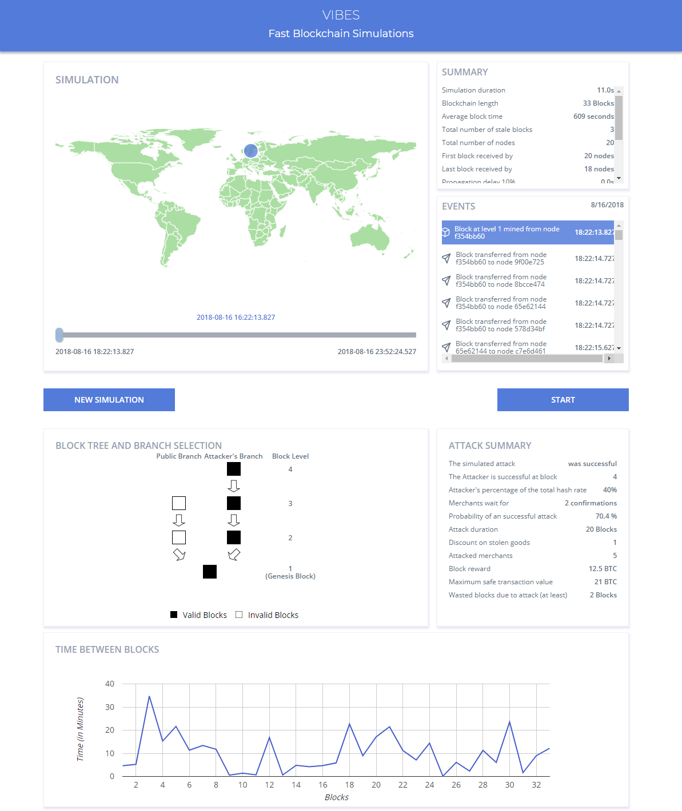
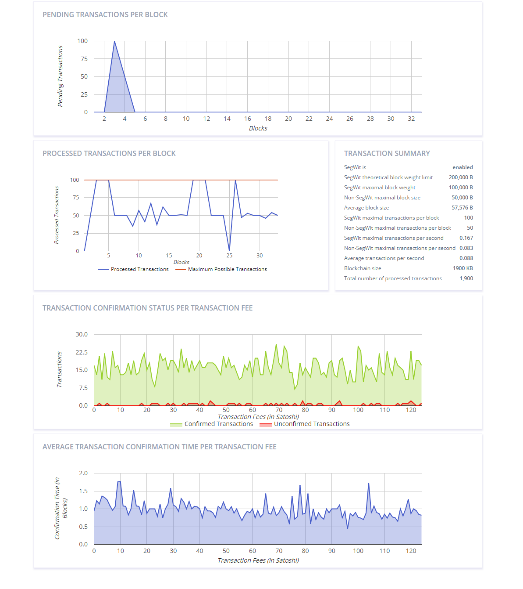
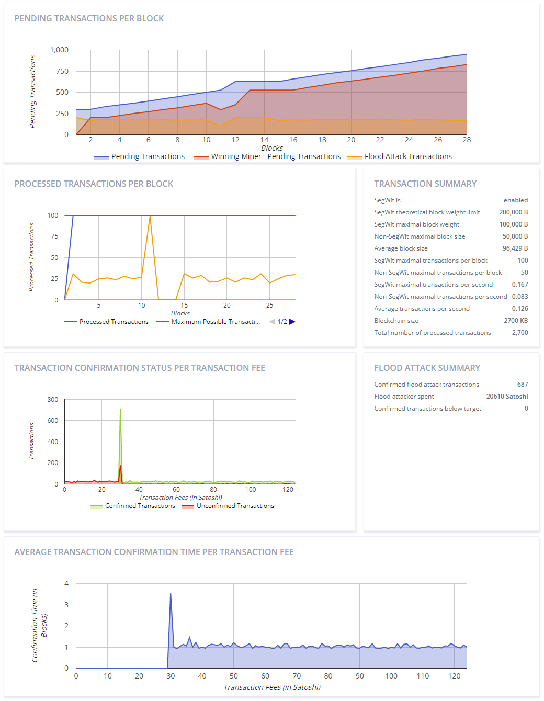

# VIBES: Fast Blockchain Simulations for Large-scale Peer-to-Peer Networks

Following the success of Bitcoin, Ethereum and Hyperledger, Blockchain technologies are now gaining widespread adoption in a wide variety of applications, using a diversity of distributed ledger systems with varying characteristics. Properties of such systems are not sufficiently analyzed. To better understand the behavior of these systems, we established VIBES: a configurable blockchain simulator for large-scale peer-to-peer networks. With VIBES, users can explore essential characteristics and metrics of the network, investigate the interactions among nodes, and intuitively compare different simulation scenarios.

[VIBES: fast blockchain simulations for large-scale peer-to-peer networks](https://dl.acm.org/citation.cfm?id=3155020)

# Installation & Documentation

[For installation, Please follow the Appendix A (Page 82) in this documentation](https://github.com/i13-msrg/vibes/blob/master/docs/Attacks-simulation-thesis.pdf)

Hint: Using IntelliJ IDEA might make the setup with Scala/sbt easier.

For detailed documentation, please review these two Master Theses:

[VIBES: Fast Blockchain Simulations for Large-scale Peer-to-Peer Networks](https://github.com/i13-msrg/vibes/blob/master/docs/Master_Thesis_VIBES.pdf)

[Bitcoin-like Blockchain Simulation System](https://github.com/i13-msrg/vibes/blob/master/docs/Attacks-simulation-thesis.pdf)

# Pictures

## Explanation for the Attack and Vulnerability Simulation Framework for Bitcoin-like Blockchain Technologies (Video)

